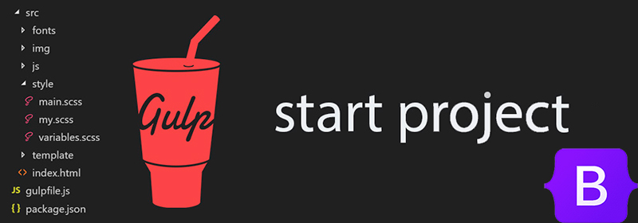

# gulp-start-bootstrap 5
											  
ПРО ЗБІРКУ
--------------------------------------------------
Gulp-start-bootstrap 5 — це стартова збірка для веброзробників, яка оптимізує процес створення сайтів на базі Bootstrap 5. Вона дозволяє швидко та зручно верстати макети з Figma, завдяки вбудованим плагінам, автоматизації типових задач і модульній структурі проєкту.

- Автор: Андрій Овчаров;
- Дата збірки: 05.06.2025.

**Збірка підтримує:** 
- Gulp: CLI version: 3.0.0
- npm: 11.1.0
- Node JS: 22.14.0 (LTS)
- Bootstrap 5: v.5.3.6

ЗБІРКА ДОЗВОЛЯЄ:
-------------------------------------------------
- Оптимізувати .css з підтримкою автопрефіксів;
- Мініфікувати (стискати) файли .css, .js та файли зображень;
- Виконувати розробку вебсайту в live-режимі з автоматичним оновленням сторінок та без кешування завдяки BrowserSync;
- Конвертувати файли зображень .png та .jpg у формат .webp та .avif;
- Оптимізувати зображення .svg та виконувати очищення кешу зображень;
- Конвертувати шрифти з .ttf та .otf у .woff та .woff2;
- Перевіряти .css файли на помилки та відповідність стандартам за допомогою CSS Lint;
- Підтримує модульну будову, розробку вебсайту з окремих компонентів;
- Показувати повідомлення про помилки під час компіляції стилів та скриптів.

ПІДГОТОВКА ТА РОБОТА ЗІ ЗБІРКОЮ:
----------------------------------------------------
1. Встановити/оновоти до останньої версії Node.js: (^22.14.0)
2. Встановити npm пакетний менеджер
3. Команди для встановлення gulp (у разі потреби):  
```npm install --global gulp-cli```
```npm install --save-dev gulp```
4. Розгорнути стартову збірку: ```npm i``` (або ```npm install```)
5. Запустити gulp: ```gulp``` (або ```npm run dev```)
6. Завершити роботу gulp: Ctrl+C
7. Зібрати остаточний проєкт в папку /dist: ```gulp build``` (або ```npm run build```)


СТРУКТУРА ЗБІРКИ:
----------------------------------------------------
```
app/
|-- components/
|   |-- header.html
|   |--header.html
|
|-- fonts/
|   |-- src/ // Шрифти у форматах .ttf та .otf для подальшої конвертації
|   
|-- images/
|   |-- icons/ // Зображення .svg
|   |-- src/ // Зображення у форматах .png та .jpg для подальшої конвертації
|
|-- js/ 
|   |-- main.js // Кастомні скрипти
|   
|-- pages/
|   |-- index.html // Головна сторінка до якої під"єнуються компоненти header.html, header.html
|
|-- scss/
|   |-- _vars.scss // Змінні
|   |-- _colors.scss // Палітра кольорів Bootstrap 5
|   |-- _fonts.scss // Стилі шрифтів
|   |-- _mixins.scss // Міксини
|   |-- main.scss // Кастомні стилі
|
|-- vendor/
    |--css/   
      |-- bootstrap.min.css  
    |--js/   
      |-- bootstrap.bundle.min.js  

.gitignore
gulpfile.js 
package.json
readme.txt
```


ПЕРЕВІРКА РОБОЧОГО СТАНУ ЗБІРКИ:
----------------------------------------------------
Після розпаковки вмісту архіву у теку з проєктом необхідно розгорнути Збірку (команда: npm i) та запустити Gulp (команда: gulp).
Якщо у вікні браузера відобразиться текст привітання, то збірка працює коректно, та її можна використовувати.


РОБОТА З ФАЙЛАМИ ПРОЄКТА
---------------------------------------------------

Робота із зображеннями:
Всі вихідні зображення потрібно зберігати у теці app/img/src. Зображення будуть конвертовані у формат .webp та avif.
Зображення іконок svg не конвертуються, а лише стискаються. Такі зображення необхідно зберігати в окремій теці: app/img/icons. 
Після обробки, зображення іконок буде автоматично додано до теки: app/img/icons.


Робота зі шрифтами:
---------------------------------------------------
Всі вихідні шрифти у форматі .ttf та .otf необхідно зберігати у теці: app/fonts/src. Всі вони будуть конвертовані у формати: .woff та .woff2 та переміщені до теки: app/fonts. 
Для успішної конвертації шрифтів, бажано зупинити Gulp, додати шрифти до папки та повторно запустити Gulp. Конвертація шрифтів може зайняти деякий час.


Робота зі стилями css:
---------------------------------------------------
Переважна більшість вихідних стилів необхідно прописувати у файлі main.scss за адресою app/css.

Де можна імпортувати додаткові файли:

- @import  'vars';  // Вказуються стилі змінних
- @import  'colors';  // Палітра кольорів Bootstrap 5: [All colors](https://getbootstrap.com/docs/5.3/customize/color/#all-colors)
- @import  'mixins'; // Вказуються міксини
- @import  'anim'; // Вказуються стилі для анімації
- @import  'fonts'; // Вказуються стилі для шрифтів
- @import  'global';  // Вказуються глобальні стилі
- @import  'libs';  // Вказуються стилі до плагінів
- @import  'main'; // Вказуються всі стилі окрім глобальних
- @import  'media';   // Вказуються стилі для адаптиву

У цьому випадку відповідні файли варто зберігати у app/css, а їх назва має починатися з нижнього підкреслення. Приклад: _vars.scss.


Робота зі скриптами javascript:
----------------------------------------------------
Усі вихідні скрипти бажано прописувати у відповідні файли за адресою app/js/custom.js. Скрипти плагінів, встановлені через npm, необхідно прописувати gulpfile.js.


Робота зі сторінками html:
----------------------------------------------------
Всі сторінки html слід зберігати за адресою: app/pages, а окремі їх компоненти (header.html, sidebar.html, footer.html та ін.) рекомендується зберігати за адресою: app/components і під'єднувати до html-сторінок, через @@include.

Наприклад: 

@@include('header.html') - під'єднуємо header.html

... код сторінки ...

@@include('footer.html') - під'єднуємо footer.html

Корисні плагіни:
----------------------------------------------------
Для зручності роботи, рекомендую використовувати наступні плагіни для VS Code:
- <a href="https://marketplace.visualstudio.com/items?itemName=HansUXdev.bootstrap5-snippets">Bootstrap 5 & Font Awesome Snippets</a>.
- <a href="https://marketplace.visualstudio.com/items?itemName=AnbuselvanRocky.bootstrap5-vscode">Bootstrap 5 Quick Snippets</a>.


## ☕ Сподобалась збірка? 
Пригостіть автора кавою через [PayPal](https://www.paypal.com/donate/?business=datoshcode@gmail.com)


**Приємної роботи!**




 ## Ліцензія

<a href="LICENSE">MIT LICENSE</a>
